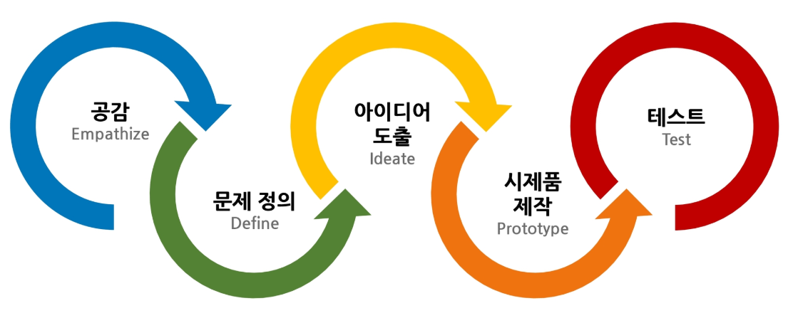

## Design Thinking: 사용하는 사람에 대한 공감 + 기술 

### 사례
- GE MRI Adventure Series
- AirBnB
- 화이자 제약의 금연 캠페인

## 디자인씽킹 Process

|Empathize|Define|Ideate|Prototype|Test|
|---|---|---|---|---|
|관찰, 인터뷰, 체험으로 문제점을 발견|문제점에 대해 정의하고 분석하는 단계|아이디어를 자유롭게 발산하는 과정|아이디어를 구현하는 과정|피드백을 통해 아이디어를 개선 |

### 1. Empathize
|공감지도|고객여정맵|페르소나|
|---|---|---|
||||

### 2. Define
- 관점서술문 작성

### 3. Ideate
- How Might We
  1. How: (핵심질문) 어떻게 하면 우리가 ~을 할 수 있을까? (가능성 확장) 어떤 방법으로 우리가 ~을 할 수 있을까?
  2. Might: (장애요소 발견) 무엇이 문제 해결을 막고 있는가?
  3. We: (현실적인 접근) 우리가 ~을 할 수 있는 방법은 무엇인가? (강제 연상) 만약 ~한다면 어떤 일이 일어날까?
- SCAMPER
  1. Substitute: 플라스틱 대신 활용할 수 있다면?
  2. Combine: 통신과 컴퓨터를 결합하면?
  3. Adapt: 가시를 울타리에 응용하면?
  4. Modify, Magnify, Minify: 아이스크림을 종이나 컵에 담지 않는다면?
  5. Put to Other Uses: 자꾸만 떨어지는 접착제는 어디에?
  6. Eliminate: 선풍기에 날개가 없다면?
  7. Reverse, Rearrange: 김밥에서 김을 안에 넣으면?
- 그 외: 브레인라이팅, 아이디어보드, PMI 피드백, 마인드맵
|브레인라이팅|아이디어보드|PMI피드백|
|---|---|---|
||||

### 4. Prototype
- 목업
  - justinmind, balsamiq, adobeXD
- PPT, 전지, Role Play, 드라마, UCC, 광고 등

### 5. Test
- World Cafe: 호스트와 서기가 세워져 다른 팀 게스트들을 맞이해 기술을 설명하고 피드백을 받는 방법
- 피벗: 검증을 통해 수집된 통찰과 다른 기술 및 맥락적 기반을 바탕으로, 개발의 방향을 빠르게 전환해나가는 것
